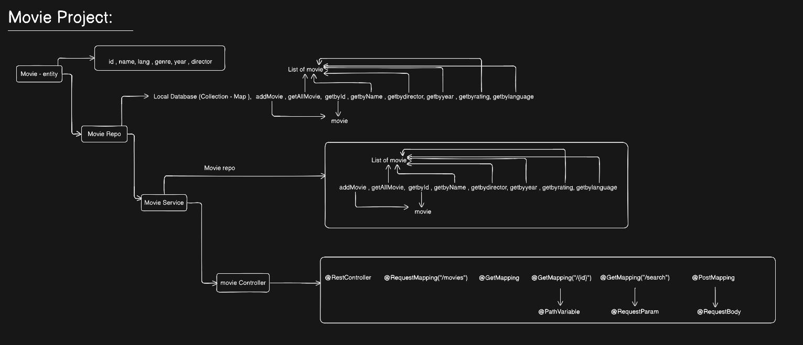

# 🎬 Movie Management API

A RESTful Movie Management API built using Spring Boot that allows users to manage and search movie records using an in-memory database.

This project demonstrates the fundamentals of Spring Boot, REST API development, Dependency Injection, Layered Architecture, and Repository Pattern.

---

## 🚀 Features

- Add a new movie
- Get all movies
- Get movie by ID
- Search movie by name
- In-memory data storage using HashMap
- Layered Architecture (Controller → Service → Repository)
- RESTful API design
- Dependency Injection using Spring Framework

---

## 🛠️ Tech Stack

- Java 17+
- Spring Boot
- Spring Web
- Maven
- Postman
- HashMap (In-Memory Database)

---

## 📂 Project Structure

```text
MovieProject
│
├── controller
│   └── MovieController.java
│
├── service
│   └── MovieService.java
│
├── repository
│   └── MovieRepository.java
│
├── entity
│   └── Movie.java
│
└── MovieProjectApplication.java
```

---

## 🏗️ Architecture

```text
Client (Postman)
        │
        ▼
MovieController
        │
        ▼
MovieService
        │
        ▼
MovieRepository
        │
        ▼
 HashMap Database
```

---

## 🎥 Movie Entity

The Movie entity contains the following fields:

| Field | Type |
|---------|---------|
| id | Long |
| movieName | String |
| movieYear | Integer |
| movieRating | Double |
| genre | String |
| director | String |

---

## 📌 API Endpoints

| Method | Endpoint | Description |
|----------|-------------|-------------|
| GET | /movies | Get all movies |
| GET | /movies/{id} | Get movie by ID |
| GET | /movies/search?name={name} | Search movie by name |
| POST | /movies | Add a new movie |

---

## 📥 Add Movie

### Request

```http
POST /movies
```

### Request Body

```json
{
  "id": 6,
  "movieName": "Toxic",
  "movieYear": 2026,
  "movieRating": 9.5,
  "genre": "Action",
  "director": "South Director"
}
```

### Response

```json
{
  "id": 6,
  "movieName": "Toxic",
  "movieYear": 2026,
  "movieRating": 9.5,
  "genre": "Action",
  "director": "South Director"
}
```

---


---

## 🔍 Search Movie


## 🗄️ Default Data

The application automatically loads movie data during startup using `@PostConstruct`.

Preloaded Movies:

- Dhurandhar
- KGF
- Pushpa
- Money Hist
- 3 Idiots

---

## 🔧 Spring Annotations Used

| Annotation | Purpose |
|------------|----------|
| @RestController | Creates REST APIs |
| @RequestMapping | Defines base URL |
| @GetMapping | Handles GET requests |
| @PostMapping | Handles POST requests |
| @PathVariable | Reads value from URL |
| @RequestParam | Reads query parameters |
| @RequestBody | Reads request body data |
| @Service | Defines business logic layer |
| @Repository | Defines data access layer |
| @Autowired | Dependency Injection |
| @PostConstruct | Executes method after bean creation |

## 🌐 Base URL

```http
http://localhost:8080/movies
```

---

## 📸 LLD of This Project





## 📚 Learning Outcomes

Through this project, I learned:

- Spring Boot Fundamentals
- REST API Development
- Dependency Injection
- Layered Architecture
- Repository Pattern
- Java Collections Framework
- Java Streams API
- API Testing using Postman

---

## 👨‍💻 Author

**Rohit Kumar Pandit**

Spring Boot Practice Project focused on learning REST APIs, Spring Boot architecture, and backend development concepts.

---